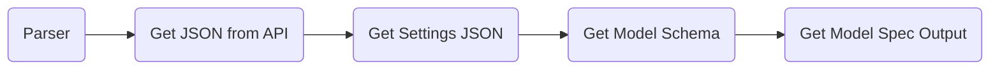

# Parser

**OCLAVI** parser is a toolkit to convert the **OCLAVI** annotated data into other open source models input data.

  - COCO
  - *MaskRCNN (TODO)*
  - *YOLO (TODO)*
  - *TFRecord (TODO)*

## Prerequisite

 - Python >= 3.5
 - OCLAVI Registered Email (Main Account)
 - OCLAVI Project ID (https://app.oclavi.com/profile/projects/**XXXXXXXXXXXXXXXXXXX**/image_settings)
 - OCLAVI Token (Export Token) - Can be found with in the project folder
 - OCLAVI activeStorage Name
	 - GOOGLE_DRIVE
	 - S3
	 - DROPBOX
	 - GCP
	 - ONEDRIVE
	 - AZURE_STORAGE

## Executing

 1. Clone this repo [https://github.com/oclavi/parser](https://github.com/oclavi/parser)
 2. Create a virtual environment 
	  > virtualenv --python /usr/bin/python3 venv
 3. Modify the following **_parser** function arguments in the **test.py** file located inside **python** folder,
	 - email id
	 - project_id
	 - token
	 - activeStorage 
 5. Run the **test.py*** file,
	> python python/test.py

